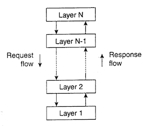
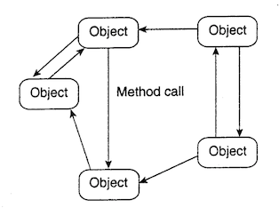
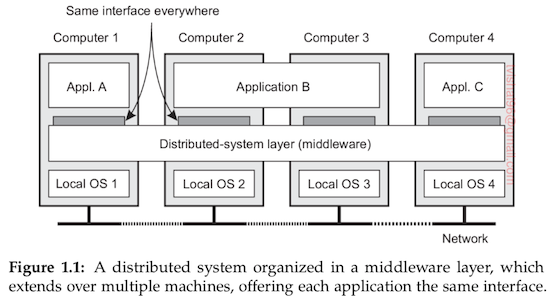

# Distributed Computing Systems

## Unit 1: Fundamentals and Architectures

### Introduction

- From 1945 - 1985, **computers operated independently** from one another.
- Starting in the mid-1980s, **two advances in technology** began to change that situation.
  1. The development of **powerful microprocessors**.
  2. The invention of **high speed computer networks.**
- Also, we have witnessed the **miniaturization** of computer systems.
  - Smartphones
  - Plug computers (like Raspberry Pi)
- Due to the evolution of these technologies, it is now **easy to create a computing system made of a large number of networked computers**.
- These computers are generally **geographically dispersed**. That is why, such a system is called a **distributed system**.

> A distributed system is a collection of autonomous computing elements that appears to its users as a single coherent system.

- The **size** of a distributed system **may vary** from a handful of devices to millions of computers.
- The **interconnection network** may be **wired, wireless, or a combination of both.**

### Characteristics of Distributed Systems

#### Characteristic 1: Collection of autonomous computing elements

- A distributed system is a **collection of computing elements** which are able to **behave independently** of each other.
- A computing element is called a **node**. A node can be a **hardware** device or a **software** process.
- Nodes are of **many different types:**
  - High performance computers
  - Small plug computers
- Nodes are **programmed to achieve common goals**.
- Nodes **communicate** with each other **through message passing.**
- A node reacts to incoming messages and processes them, which leads to further communication through message passing.
- We **need to manage** the **membership and organization** of the collection of nodes. This involves:
  1. Registering **which nodes belong to the system** and which don't. (Membership)
  2. Providing each node with a **list of nodes it can directly communicate with**. (Organization)

#### Characteristic 2: Single coherent system

- A distributed system should **appear as a single coherent system**.
- Some researchers even say that there should be a **single system view** (the end users should not realise that they are dealing with processes and data that are dispersed across different computers).
- A single coherent system **should behave the same irrespective of** where, when and how **interaction** between the user and system takes place.
- This is challenging because the end user should not be able to tell which device a process is running on, or which device the data is stored on. This is called **distribution transparency**. It is an important design goal of distributed systems.
- This also introduces a **trade-off**. We cannot ignore that **some part of the distributed system may fail** at any given time. This results in **unexpected behaviour** like: some applications are executing successfully and some have crashed.

### Characteristics of Distributed Systems (reference book)

- **Multiple Entities:** A key characteristic of distributed systems is that they are made up of multiple entities. These entities may be single nodes or subsystems that make up the system.
- **Heterogenity:** Another key characteristic is the heterogeneous nature of the components. They may be different in terms of the system, user, underlying policies and the data/resources they consume.
- **Concurrency:** A key characteristic that distinguishes distributed systems from centralised ones is concurrency. Different components of a distributed system may run concurrently as they may be loosely coupled.
- **Resource Sharing:** Another important characteristic of distributed systems is that resources are shared among components.

### Examples of Distributed Systems

#### Web Search

- The task of a web search engine is to index the entire contents of the World Wide Web.
- This is a challenging task as the web now consists of billions of web pages.
- A search engine is a distributed system. Highlights of its infrastructure include:
  - Underlying physical infrastructure. Lots of networked computers all across the world.
  - Distributed file system to support large files and fast access.

#### Massively Multiplayer Online Games (MMOGs)

- They offer an immersive experience to users by allowing them to interact through the Internet with a shared online world.
- The task of creating and maintaining an MMOG presents many challenges to distributed systems design, like the need for fast response times to preserve user experience and real-time propagation of events to all users to maintain the shared view of the world.

#### Financial Trading

- In finance, there is a need for real-time access to information such as current stock prices and political events.
- Here, the emphasis is on the communication of events in a reliable and timely manner to lots of users.
- These systems use a very different kind of underlying arhitecture (as opposed to the client server architecture). Distributed event based systems are used.

### Design Goals

There are 4 design goals of distributed systems

1. Supporting resource sharing
2. Making distribution transparent
3. Being open
4. Being scalable

#### Supporting Resource Sharing

- An important goal is that a distributed system should **make it easy** for users (and applications) **to access** and share remote **resources**.
- **Resources can be** virtually **anything**. Some examples include files, services, storage facilities and networks.
- There are **many reasons** for wanting to share resources.
  - It is **economical**. For example, it is cheaper to have one high-end reliable storage facility that can be shared than it is to buy and maintain storage for individual users separately.
  - It **makes collaboration**, communication and exchange of information **easier**.

#### Making distribution transparent

- An important goal for a distributed system is to **hide** the fact **that its processes and resources are dispersed** over multiple computers. In other words, it should try to **make** the **distribution** of processes and resources **transparent**.
- There are different types of distribution transparencies:
  1. **Access transparency** refers to hiding differences in data representation and how an object is accessed.
  2. **Location transparency** refers to hiding where an object is physically stored.
  3. **Relocation transparency** refers to hiding that an object may be moved to another location while it was in use.
  4. **Migration transparency** refers to hiding that an object may be moved to a different location.
  5. **Replication transparency** refers to hiding that an object is replicated, i.e. several copies of an object exist.
  6. **Concurrency transparency** refers to hiding that an object may be shared by multiple users.
  7. **Failure transparency** refers to hiding the failure and recovery of (a part of) the system.

#### Being open

- Another important goal of distributed systems is **openness**.
- An open distributed system is one that **offers components that can** easily **be used by**/integrated into **other systems**.
- Open distributed systems should be **interoperable, easily composable and extensible**.
  - Composable: It should be **easy to configure** the system **out of different components**.
  - Extensible: It should be **easy to add new components or replace existing ones** without affecting the rest of the system.

#### Being scalable

- Until recently, we were used to having **powerful desktop computers** for office and storage related tasks.
- However, with the **transition** of these services **into "the cloud"**, we have seen an **increase** in the number of **smaller networked devices** like smartphones and tablets.
- Due to this, **scalability** has become **one of the most important design goals** of distributed systems.

### Types of Distributed Systems

There are 3 types of distributed systems:

#### High performance distributed computing

- The first class of distributed systems is the one **used for high performance computing**. Roughly, there are two types.
  - **Cluster computing:** Here, the underlying hardware is made up of **similar nodes** connected by means of a high speed LAN. Furthermore, all nodes run the **same OS**.
  - **Grid computing:** These systems are often constructed as a **federation of computer systems** where each system may fall under a different administration, and **each node may be very different** when it comes to hardware, software and underlying network technology.

#### Distributed information systems

- Another important class of distributed systems is one found in organizations that were faced with a lot of networked applications, but for whom interoperability was not feasible.
- Many middleware solutions are the results of working with an infrastructure in which it was easier to integrate applications into a enterprise wide information system.

#### Pervasive systems

- **In distributed computing and information systems**, the **nodes are stable**. They are generally fixed and have a strong connection to a network.
- However, **things have changed** with the **introduction of smartphones** and embedded computing systems, **leading to** systems that are called **pervasive systems**.
- As the name suggests, pervasive systems are **designed to blend into our environment**. They are **naturally distributed** systems.
- What makes them very different in comparison to computing and information systems is that the **boundary between users and system components** is much more **blurred**. There is **no single interface**, like a screen/keyboard combination. Instead, a pervasive system is equipped with **lots of sensors** to pick up various aspects of the user's behaviour.

### Architectural Styles

- An architectural style is formulated in terms of components, how these components are connected to each other, the data exchanged between these components, and how these components are jointly configured into a system.
- The most important architectural styles for distributed systems are:

#### Layered architectures

- Components are organised in a layered fashion, where a component at layer $L_j$ is allowed to call components at an underlying layer $L_i$ ($i < j$), but not the other way round.

- Control flows from layer to layer. Requests go down the hierarchy and responses flow upward.

#### Object based architectures

- Object based architectures have a far looser organization.

- Each object corresponds to a component, and these components are connected by means of a remote prodecure call (RPC) mechanism.

#### Data-centered architectures

- These revolve around the idea that processes communicate through a central (common) data repository.
- For distributed systems, these architectures are just as important as layered and object based architectures.

#### Event-driven architectures

- In these, processes communicate through the propagation of events (which may carry data).
- For distributed systems, event propagation is generally associated with publish/subscribe systems. In these, published events are only propagated to those processes which have subscribed to them.
- The main advantage of event-driven architectures is that they are loosely coupled.

### Middleware and Middleware Organization

#### Middleware

- Distributed systems often have a separate layer of software that is logically placed over the OS of the nodes of the system.

- In a sense, middleware is the same to a distributed system what an OS is to a computer.
- The main difference between middleware and OSs is that middleware services are offered in a networked environment.

#### Middleware Organization

- There are two design patterns applied to the organization of middleware:
  - Wrappers
  - Interceptors
- They target different problems but aim to achieve the same goal for middleware: openness.
- A wrapper/adapter is a special component that offers an interface acceptable to a client application by transforming the functions into those available at a legacy component.
- It solves the problem of incompatible interfaces.
- An interceptor is a software construct that will interrupt the usual flow of control and allow other code to be executed.