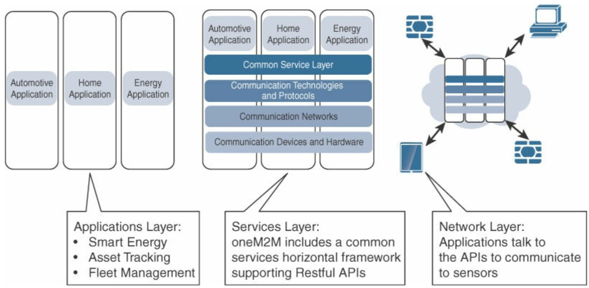
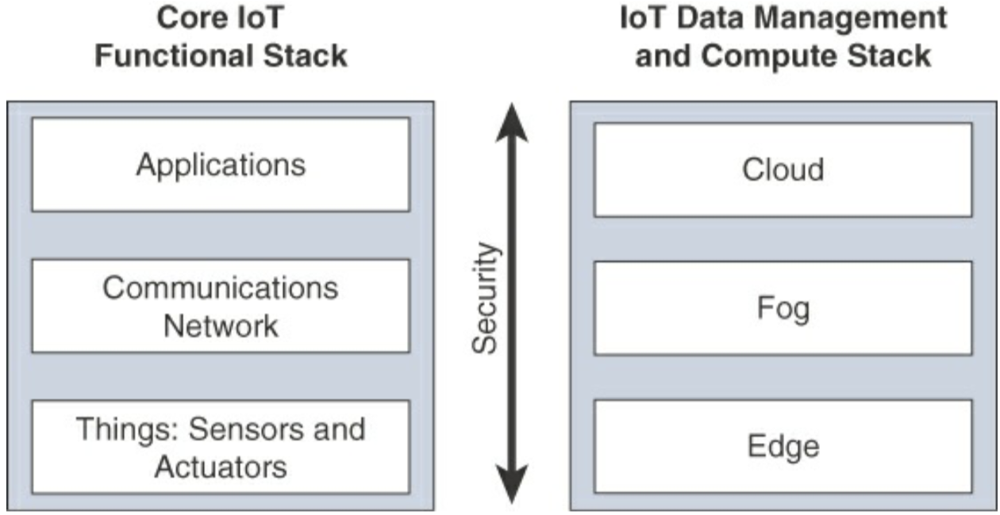
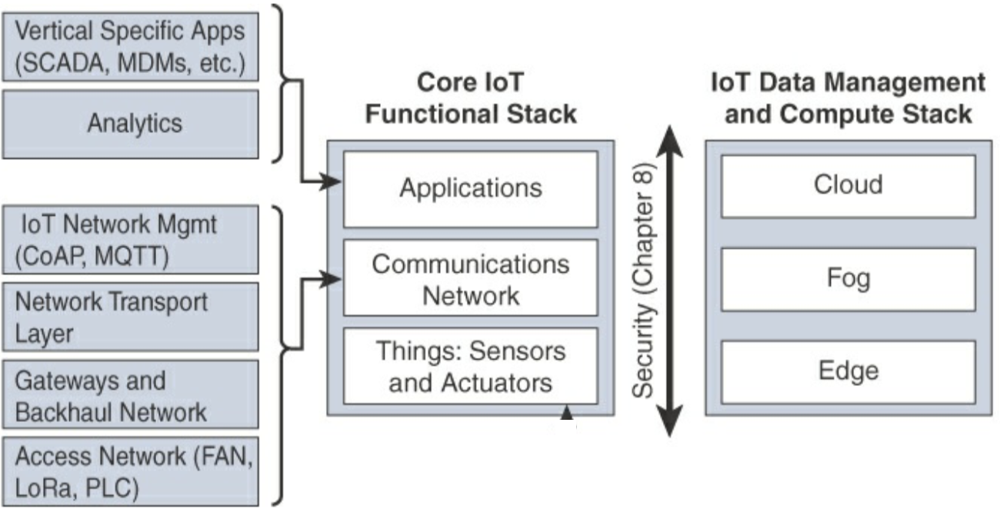

# Internet of Things

## Unit 2: IoT Network Architecture and Design

### The oneM2M IoT Standardized Architecture

- The oneM2M architecture divides IoT functions into 3 major domains:
  - The applications layer
  - The services layer
  - The network layer

- While this architecture may seem simple and somewhat generic at first, it is very rich and promotes iteroperability through IT-friendly APIs and supports a wide range of IoT technologies.

- **The applications layer:** Major attention is given to connectivity between devices and applications. This layer includes application layer protocols and attempts to standardize APIs for interaction with business systems.
- **The services layer:** Shown as a horizontal framework across the vertical industry applications. Horizontal modules include the physical network and the underlying management protocols and hardware. The common services layer is at the top of this domain.
- **The network layer:** Communication domain for IoT devices and endpoints. Includes the devices and the communication network that links them.

### IoT World Forum Standardized Architecture

- This architecture defines a stack of 7 levels in which control flows from the centre (cloud service/data centre) to the edge (sensors, devices, machines). In general, data flows up the stack from the edge towards the centre.
- Using this architecture, we are able to:
  - Break the IoT problem down into smaller parts.
  - Identify different technologies at each layer and how they relate to each other.
  - Create a system in which different parts can come from different vendors.
- The 7 layers are:
  1. **Physical devices and controllers layer:**
     - Home to the "things".
     - Size of things can range from microscopic to giant factories.
     - Primary function is generating data and being capable of being queried/controlled over a network.
  2. **Connectivity layer:**
     - Main function is reliable and timely transmission.
     - Transmissions: layer 1 > network > layer 3.
  3. **Edge Computing layer:**
     - Often referred to as the "fog" layer.
     - Emphasis is on data reduction and converting network data flows into information that is ready to be processed/stored by higher layers.
  4. **Data accumulation layer:**
     - Captures data and stores it.
  5. **Data abstraction layer:**
     - Reconciles multiple data formats and ensures consistent semantics.
     - Ensures that the data set is complete.
  6. **Applications layer:**
     - Main task is to interpret data using software applications.
  7. **Collaboration and processes layer:**
     - Consumes and shares application information.

### A Simplified Architecture

- This architecture is presented as two parallel stacks: The Core IoT Functional Stack and the IoT Data Management and Compute Stack.

- The presentation of the Core IoT Functional Stack in 3 layers is meant to simplify understanding. Of course such a simple architecture needs to be expanded on.

- The IoT Data Management and Compute Stack consists of the:
  - **Edge layer:** Data management within sensors.
  - **Fog layer:** Data management in the gateways and network.
  - **Cloud layer:** Data management in the cloud/central data server.

### The Core IoT Functional Stack

- From an architectural standpoint, several components have to work together for an IoT network to be operational:
  1. **Things layer: Sensors and Actuators:** The objects must fit the constraints of the physical system while also continuing to collect and send information.
  2. **Communications network layer:** If the architecture is not self-contained, there is a need to interact with external systems. This layer has 4 sub layers.
     1. **Access network sublayer:** The access layer is the last mile of the IoT network.
     2. **Gateway and backhaul network sublayer:** The communication system organises smart objects around a gateway. The role of the gateway is to communicate directly with the objects and forward the collected information through a longer range medium (backhaul) to the headend central station where the information is stored.
     3. **Network transport sublayer:** Communication protocols of the network and transport layers like IP and UDP must be implemented.
     4. **IoT network management sublayer:** Additional protocols must be in place to allow headend applications to communicate with the sensors.
  5. **Applications layer:** At the upper layer, an application needs to access the data collected, not only to control the smart objects, but also to make intelligent decisions based on the data.

### The IoT Data Management and Compute Stack

#### Fog Computing

- With the growth in size of the IoT network, there is a rise in data management issues.
- The solution to these challenges is to distribute data management in the network, close to the edge of the IoT network.
- The best known embodiment of edge services in IoT is fog computing.
- Any device with computing, storage and network connectivity can be a fog node.
- Analysing data close to the place where it is collected:
  - minimizes latency
  - offloads a lot of data from the core network
  - keeps sensitive data inside the local network
- This introduces a new layer to the IT computing model: the fog layer.

#### Edge Computing

- In recent years, the concept of IoT computing has been pushed even further to the edge, and it even resides directly in the sensors, IoT devices.
- They generally have constrained computing capabilities, but as computing capabilities increase, some endpoints have enough power to perform at least low level analytics and filtering and make basic decisions.

#### The Hierarchy of Edge, Fog and Cloud

- Edge or fog computing do not replace the cloud. They complement each other.
- Many use cases require strong cooperation between them.
- Edge and Fog computing act as the first line of defense in filtering and analysing data. This saves the cloud from being queried by every node for each event.
- Advantage of this hierarchy: Responses to events from resources close to the end devices come faster and deeper compute capabilities are available in the cloud.
- From an architectural standpoint, the fog nodes closest to the edge of the network receive data from IoT devices and they direct different types of data to the optimal place for analysis.
  - Time sensitive data: fog/edge node.
  - Data that can wait a few seconds or minutes: aggregation node.
  - Less time sensitive data: cloud for historical, big data analysis.